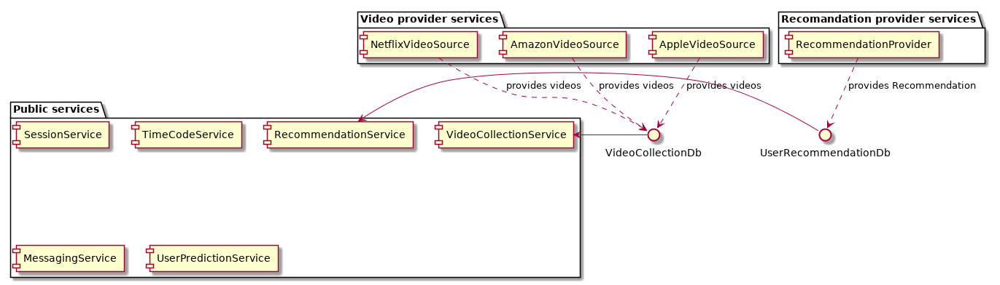
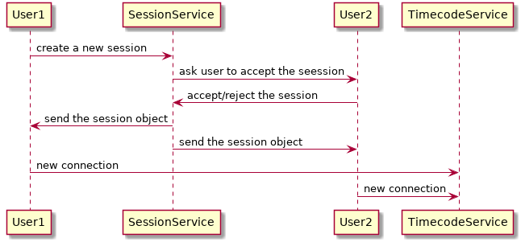
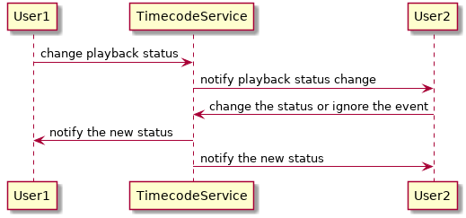
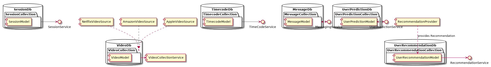
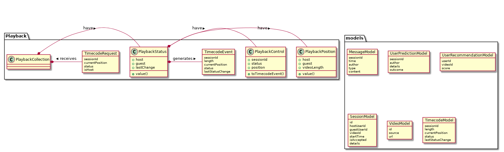

DATEFLICKS
==============


I designed a system that consists in several public services that the users can interact directly and some background services that provide data for the public services. The public services are separated by the services that provide the data and if there is one problem with a background service the user will not notice that.



Also since the background services write the data directly in the database, it's not mandatory to be up all the time. This leaves the developers ability to do A/B testing with different recommendation algorithms or to add more 3 video providers.

The session service handles the users handshake and from it's database, any service can extract the user history analyze and provide watch history or recomandations.




The Message service and User Prediction services can work independently and the users can use them based on a session id.

The most sensible service is the timecode service which will synchronize the clients. The clients will stream their video position to this service and when there is a difference between their position the service will send the new synchronized positon that all users must accept. When a client will change the timecode status, the other one will be notified that the new status has changed and if it will not respond in 60 seconds the service will automatically restore the previous status.

The timecode updates should look like this:



A database overview:


The models diagrams and the playback package used by the time code service:


The playback collection is not implemented yet, but it should be created from the timecode model

## Dependencies
  - hapi
  - mongoose
### Start the session service
```
cp settings/session.model.js settings/session.js
npm install
npm run session
```

### Start the timecode service
```
cp settings/timecode.model.js settings/timecode.js
npm install
npm run timecode
```

### Run the tests with `mocha`
```
npm test
```

the test process hangs after the result. I will fix this issue ASAP.
